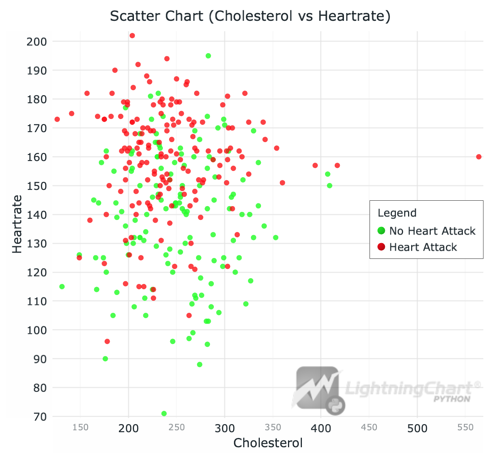
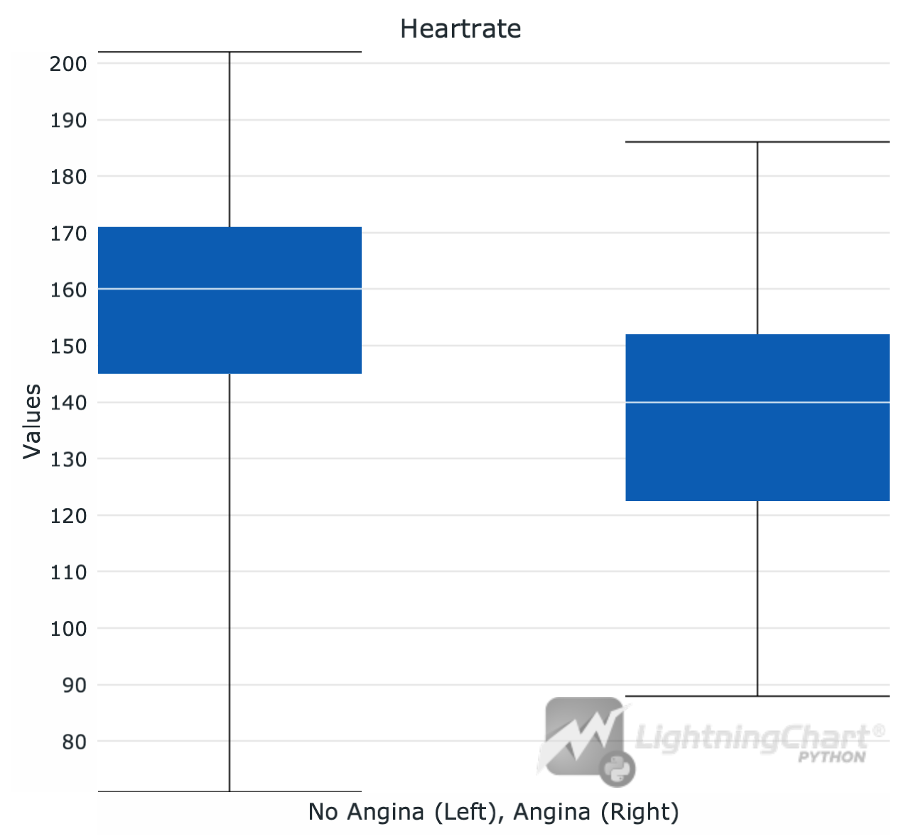
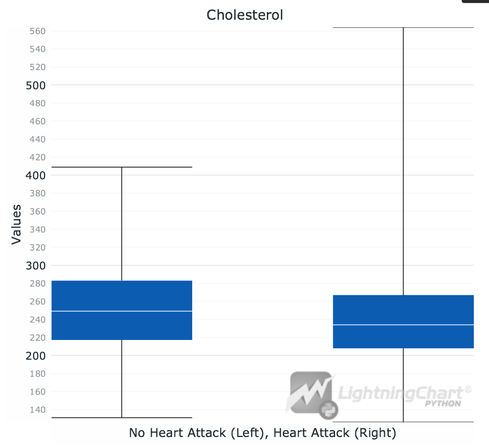
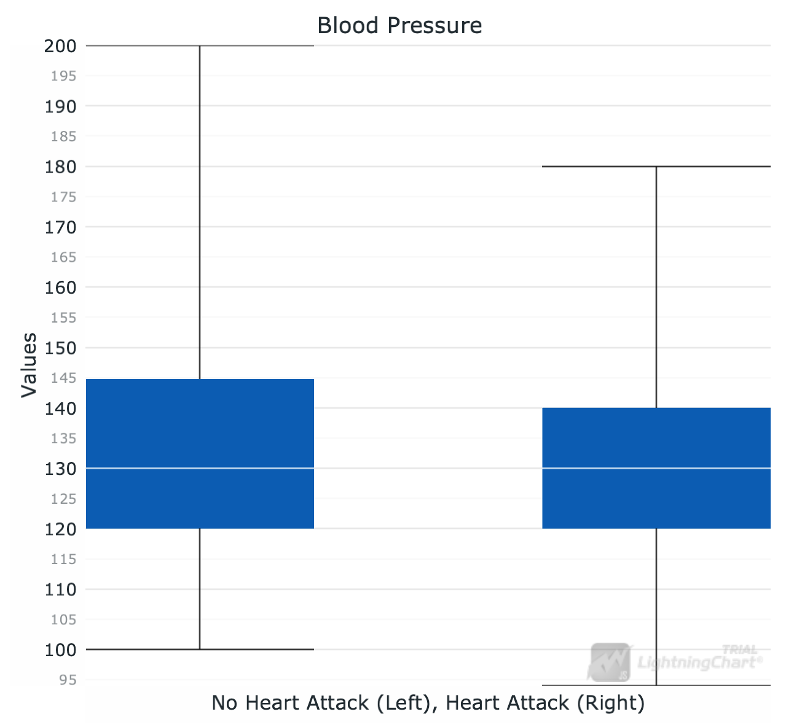
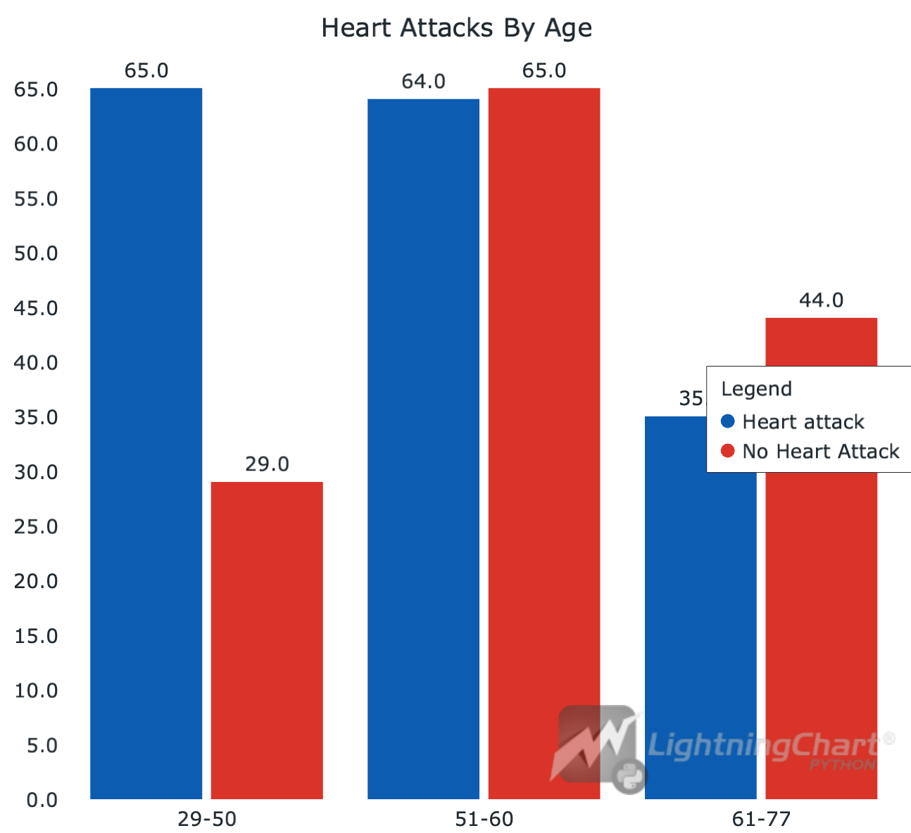

# Heart attack analysis and predictions in Python with LightningChart
## Introduction
### Causes of Heart Attacks
The main cause of the heart attack is <u>coronary artery disease</u>. It is one of the most common heart diseases.

The cause of the coronary heart disease is *plaque*, which is a substance that builds up inside arteries and blocks the supply of oxygen saturated blood to the heart.
This buildup is called <u>atherosclerosis</u>, and the insufficient blood flow saturated with oxygen *coming* to the heart is called <u>ischemia</u>.

*Plaque rupture* (the rapture of the tissue covering the plaque) can then happen, which leads to blood clots, blocking the arteries even more.

<u>Hypoxia</u> is the lack of oxygen in the organs itself, including heart. Thus, in our context, all this terminology is almost the same. 

### Unhealthy Habits and Other Factors of <u>Atherosclerosis</u>
The main factors that increases the risk of plaque buildup:
- unhealthy diet
- smoking
- lack of physical activity
- diabetes
- high cholesterol
- age 

*and others*


### Heart Failure
Heart attack is one of the leading causes of **heart failure**, which is when heart cannot supply enough blood to the organs of the body. \
When a heart attack happens, it can lead to necrosis (death of the *myocardium* - tissue of the heart). Building necrosis can eventually lead to heart failure.

## LightningChart Python
For this task we will use [LightningChart](https://lightningchart.com/python-charts/) library. It provides a wide range of tools for creating graphs that are also useful for heart attack analysis in Python. 

In this project, we will use:
1. - XY Chart ([Link to docs](https://lightningchart.com/python-charts/docs/charts/chart-xy/)) \
   *in combination with*
   - Point Series ([Link to docs](https://lightningchart.com/python-charts/docs/charts/chart-xy/#point-series))
2. Grouped Bar Chart ([Link to docs](https://lightningchart.com/python-charts/docs/charts/bar-chart/#grouped-bar-chart))
3. Box Plots ([Link to docs](https://lightningchart.com/python-charts/docs/charts/box-plot/))

LightningChart provides easily-to-initialize charts that are also easily and widely customizable, so we will use this library for the visualizations.

## Setting Up Python Environment
For heart attack prediction in Python, first we need to set up our Python environment. 
### Installation of Python on Mac
I recommend using [Homebrew package manager](https://brew.sh/) as it is popular and has a lot of packages.\
Moreover, it is arguably more convenient than installing Python using .dmg.

#### 1. First step is installing Homebrew itself
> You can skip this step if it is already installed on your Mac

Enter Terminal app and copy/paste this string
```sh
/bin/bash -c "$(curl -fsSL https://raw.githubusercontent.com/Homebrew/install/HEAD/install.sh)"
```
:exclamation: **Important note:** 
  Installation of Homebrew can be not fast, usually from 5 to 15 minutes.

#### 2. Installation of Python
```sh
brew install python
```
This command will install the latest stable version of python.


<details>
  <summary><b>If you don't want to use Homebrew</b></summary>
  You can access the <a href = 'https://www.python.org/downloads/macos/'>official Python website</a>, select the      latest stable version downloader for MacOS (it is named macOS 64-bit universal2 installer) and follow the installation instructions.
</details>

You can check the version using `python3 –-version` in Terminal.
> If it displays `Unknown command` error, it is most likely due to PATH variables. Refer to  
[this guide](https://www.mygreatlearning.com/blog/add-python-to-path/) to fix.

---
### Installation of Python on Windows
I recommend using cli tool [Winget](https://learn.microsoft.com/en-us/windows/package-manager/winget/). 

#### Install Python package
Open cmd or PowerShell as Administrator and type in:
```powershell
winget install Python.Python.3
```

<details>
  <summary><b>If you don't want to use Winget</b></summary>
  You can access the <a href = 'https://www.python.org/downloads/macos/'>official Python website</a>, select the      latest stable version downloader for Windows <br> (it is named Windows installer (64-bit)) and follow the installation instructions.
</details>

You can verify installation of python and pip by typing `python --version` and `pip --version` respectively. 
> If it displays `'command' is not recognized` error, it is most likely due to PATH variables. Refer to [this guide](https://www.mygreatlearning.com/blog/add-python-to-path/) to fix.
---
### Installation of IDE
For IDE (integrated development environment) I recommend using [PyCharm](https://www.jetbrains.com/pycharm/download/?section=mac) as it is clean and powerful. However, full version is paid so you can also use [VSCode](https://code.visualstudio.com/).

:exclamation: **Important:**
In this project it is better to use either Pycharm **Professional** or VSCode.

(*Optional*) You may want to set up `venv` (Python virtual environment) so you can install packages there and not clutter the Python installation.
Environment creating instructions:
- PyCharm - https://www.jetbrains.com/help/pycharm/creating-virtual-environment.html#python_create_virtual_env
- VSCode - https://code.visualstudio.com/docs/python/environments

---

### Setting up jupyter notebook

#### For PyCharm (ONLY PROFESSIONAL VERSION):
Just create an .ipynb file and start coding. The IDE will install everything needed on its own.


#### For Visual Studio Code
1. Install Jupyter extension 
2. Select and open the working directory
3. Create venv (`⇧⌘P` or `Ctrl-⇧-P`). Very recommended!
4. Refer to the article (starting from "Workspace Trust" paragraph): [click](https://code.visualstudio.com/docs/datascience/jupyter-notebooks#_workspace-trust)

---

### Libraries Used
#### Jupyter
A very nice library for data analysis, supports both executable code blocks and markdown blocks. 
With it, you can create clear and visual analysis reports.

#### Pandas
In this project, we will mainly use the dataframe, two-dimensional data structure provided by Pandas. It can be easily created from CSV or Excel file.

#### NumPy
NumPy is provided with Pandas and it is a fundamental package for scientific computing in Python. It provides support for arrays, mathematical functions, and linear algebra operations.

#### LightningChart
LightningChart is the main library used in the project for creating different types of charts in Python. It provides a highly customizable graph building tools, including simple XY charts, 3D charts, Bar charts, Spider charts, Map charts.

## Installing and importing libraries
Type in terminal to install libraries:
```sh
pip install pandas lightningchart
```
---
## Abstract: Basics of Jupyter Notebooks 
> Skip this if you are familiar with Jupyter NB 

Jupyter notebooks are much useful for data analysis tasks.

Basically, in our case, you can call Jupyter an "IDE inside an IDE". With it, you can create `.ipynb` type files which
are convenient for doing anything with data.

So what are the advantages of it, instead of the regular python files? (those with `.py` extension)
1. Jupyter supports code block, execution of which can be done separately. This means that if one block is executed,
the results of it persist (until restarting the kernel), thus you can for example, put your imports in the first block, and forget about them.
2. You can include markdown type blocks (the same format as this README is written on) to write concise annotations.
3. As you can execute blocks separately, you can get program outputs after each of these blocks for visual purposes.

For these reasons, Jupyter notebooks are visual and good for demonstration (it is often what we aim for when doing data analysis).

---

## Loading and preprocessing data

Before everything, we need to import required libraries
```python
import pandas as pd
import lightningchart as lc
```
Then, we use `read_csv` method from `pandas` library (if we had `.xslx`, we would have used `read_excel`)
```python
df = pd.read_csv('data/heart.csv')
df
```
(If you type variable name last in the block, it would be output, this is Jupyter NB feature).

### Remember to always check data consistency - for data types and null values
These methods can be in handy:
- `df.dtypes` - for checking data types of the dataframe
- `df.isnull().sum()` - for checking the number of null values in each column

> See `.ipynb` file for complete data processing and more detailed explanation.

## Data analysis

### Multi-Variable analysis

The most common method of performing multi-variable analysis is correlation matrix, and a scatter plot (sometimes heatmaps). 

But at first, as we are using `LightningChart`, we have to use the license key:
```python
with open("license_key.txt", "r") as file:  # License key is stored in 'license_key.txt'
    key = file.read()
lc.set_license(key)
```
> Note! Always remember not to leak your keys when you share code! I recommend using a file and including it in .gitignore, or session variables. 

This is a correlation matrix:
```python
numeric_columns = ['age', 'trtbps', 'chol', 'thalachh', 'oldpeak']
data_numeric = df[numeric_columns]
data_numeric.corr()
```
```
Output:
               age    trtbps      chol  thalachh   oldpeak
age       1.000000  0.279351  0.213678 -0.398522  0.210013
trtbps    0.279351  1.000000  0.123174 -0.046698  0.193216
chol      0.213678  0.123174  1.000000 -0.009940  0.053952
thalachh -0.398522 -0.046698 -0.009940  1.000000 -0.344187
oldpeak   0.210013  0.193216  0.053952 -0.344187  1.000000
```

Numbers here represent strength of correlation:
- 0.7 to 1.0 (-0.7 to -1.0) -> Strong correlation. 
- 0.5 to 0.7 (-0.5 to -0.7) -> Moderate correlation. 
- 0.3 to 0.5 (-0.3 to -0.5) -> Weak correlation. 
- 0.0 to 0.3 (0.0 to -0.3) -> Negligible correlation. 

Positive numbers mean positive correlation (as one value increases, the other does too). \
Negative numbers mean negative correlation (as one value increases, the other decreases).

Now, we can start plotting the charts.
For this task we are using LightningChart Python. It is a library designed for dealing with huge (flowing) amounts of data.
However, it is also usable for data analysis, and wwe will use its features here.
```python
chol_neg = df.loc[df['output'] == 0, 'chol'].tolist()  # get the cholesterol vals where output is 0 (no heart attack)
heartrate_neg = df.loc[df['output'] == 0, 'thalachh'].tolist()  # get the cholesterol vals where output is 0 (no heart attack)

chol_pos = df.loc[df['output'] == 1, 'chol'].tolist()  # same thing with 1
heartrate_pos = df.loc[df['output'] == 1, 'thalachh'].tolist()

scatter = lc.ChartXY(   # scatter chart intialization
    theme=lc.Themes.White,  # overall theme
    title='Scatter Chart (Cholesterol vs Heartrate)', 
)
series_neg = scatter.add_point_series().add(
    x=chol_neg,  # push samples to series
    y=heartrate_neg,
)
series_pos = scatter.add_point_series().add(
    x=chol_pos,  
    y=heartrate_pos,
)

series_neg.set_point_color(lc.Color(0, 255, 0, 192)).set_name("No Heart Attack")  # set colors for points
series_pos.set_point_color(lc.Color(255, 0, 0, 192)).set_name("Heart Attack")

scatter.get_default_x_axis().set_title("Cholesterol")
scatter.get_default_y_axis().set_title("Heartrate")
scatter.add_legend().add(scatter)
scatter.open()
```
`Output:`


It can be seen that the higher the heartrate, the more risk of the heart attack. Also, we can see that generally, the higher the cholesterol, the higher the heartrate.   
The correlation between cholesterol and the output is not very obvious.

> Note: see `.ipynb` file for more details.

### Analysis of correlation between heartrate and exercise-induced angina

We can use a Box Plot for this analysis:
```python
heartrate_angina = df.loc[df['exng'] == 1, 'thalachh'].tolist()
heartrate_noangina = df.loc[df['exng'] == 0, 'thalachh'].tolist()

boxplt_chol = lc.BoxPlot(  
    data=[heartrate_noangina, heartrate_angina],
    theme=lc.Themes.White,
    title='Heartrate',
    xlabel='No Angina (Left), Angina (Right)',
    ylabel='Values'
)
boxplt_chol.open()
```
`Output:`


It is also useful to get the mean values of each column:
```python
thalach_exang_mean = df.groupby('exng')['thalachh'].mean()
print("Mean Maximum Heart Rate by Exercise-Induced Angina:")
print(thalach_exang_mean)
```
```
Output:
Mean Maximum Heart Rate by Exercise-Induced Angina:
exng
0    155.681373
1    137.212121
Name: thalachh, dtype: float64
```
It can be seen that individuals with exercise-induced angina have a lower mean maximum heart rate. It suggests that these individuals may experience cardiovascular limitations. Angina is typically a sign that the heart muscle is not getting enough oxygen-rich blood during exertion, which could prevent these individuals from reaching higher heart rates.

### Box Plot for Cholesterol:


(All boxplots can be created analogically to the Heartrate one - just change the column name)

We can see that the extreme number of cholesterol relates to heart attack, but it is not necessary that those who have lower cholesterol are not subject to heart attacks.

### Box Plot for Blood Pressure:


Those who had a heart attack generally have less blood pressure values. It may be counterintuitive, but it shows that the blood pressure alone doesn't certainly show that the individual is subject to a heart attack or not.

### Grouped Bar Chart
Another type of chart for single variable analysis is (grouped or stacked) bar chart.
Here is an example:
```python
bins = [29, 50, 60, 77]  
labels = ['29-50', '51-60', '61-77']

df['age_range'] = pd.cut(df['age'], bins=bins, labels=labels, right=True)

mapping = {0: 'No Heart Attack', 1: 'Heart attack'}
df['output_words'] = df['output'].map(mapping)

outcome_counts_by_age = df.groupby(['age_range', 'output_words'], observed=True).size().unstack(fill_value=0)

result = []
for target in df['output_words'].unique():  # make json-like formation of data
    values = [int(x) for x in outcome_counts_by_age[target].tolist()]  
    result.append({                     
        'subCategory': target,
        'values': values
    })
barchart_grouped = lc.BarChart(  # initialize bar chart
    vertical=True,
    theme=lc.Themes.White,
    title='Heart Attacks By Age',
)
barchart_grouped.set_data_grouped(labels, result)  # set data
barchart_grouped.set_sorting('alphabetical').set_animation_category_position(False)
barchart_grouped.add_legend().add(barchart_grouped)  # add legend
barchart_grouped.open() 
```
`Output:`


## Conclusions
- Extreme numbers of cholesterol likely lead to heart attacks
- Those who have exercise-induced angina usually have lower heart rates
- Higher heart rate correlates to the risk of heart attack
- Blood pressure, as well as the age doesn't significally increase or decrease the heart attack probability

LightningCharts provided us with nice charts that can be resized, interacted with and customized to your liking
## Sources
1. Heart Attack Causes - [nih.gov](https://www.nhlbi.nih.gov/health/heart-attack/causes) 
2. Ischemia - [heart.org](https://www.heart.org/en/health-topics/heart-attack/about-heart-attacks/silent-ischemia-and-ischemic-heart-disease#:~:text=What%20is%20ischemia%3F,oxygen%20to%20the%20heart%20muscle)
3. Heart failure - [heart.org](https://www.heart.org/en/health-topics/heart-failure/what-is-heart-failure#:~:text=Heart%20failure%20is%20a%20lifelong,keep%20up%20with%20its%20workload)
4. Plaque rupture - [sciencedirect.com](https://www.sciencedirect.com/topics/engineering/plaque-rupture#:~:text=Plaque%20rupture%20occurs%20when%20the,Thomas%2C%201981%2C%201985)
5. LightningChart - [lightningchart.com](https://lightningchart.com/)
6. Jupyter - [jupyter.org](https://jupyter.org/)
7. Pandas - [pandas.pydata.org](https://pandas.pydata.org/)
8. NumPy - [numpy.org](https://numpy.org/)